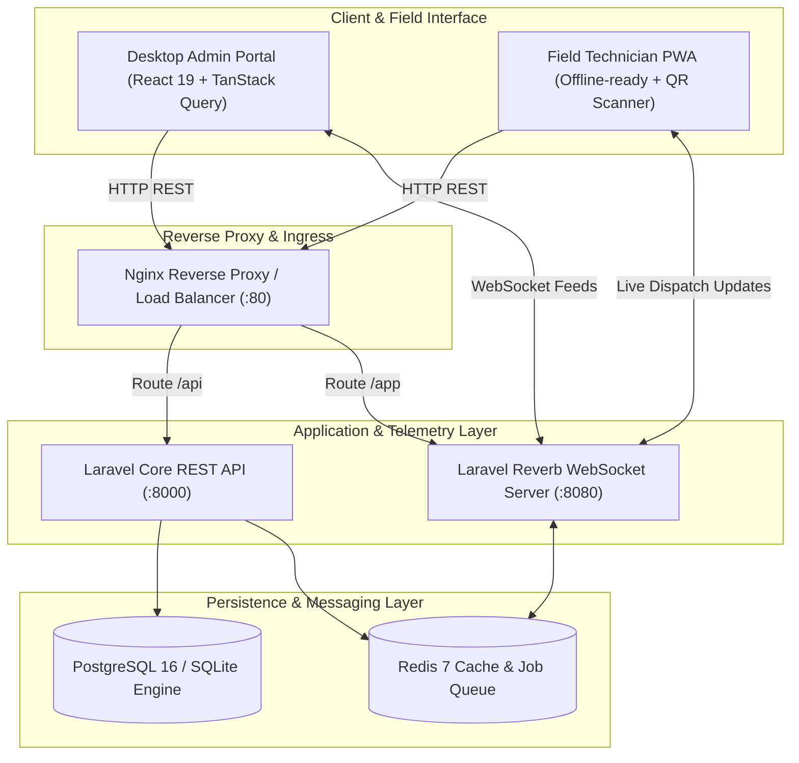
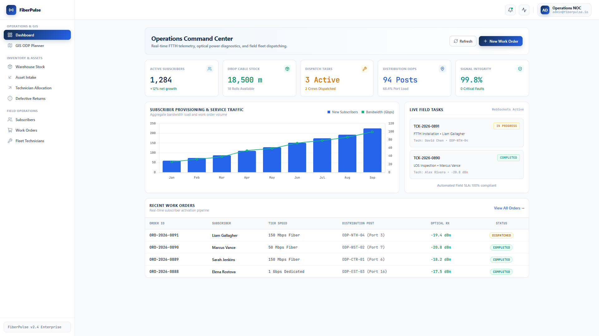
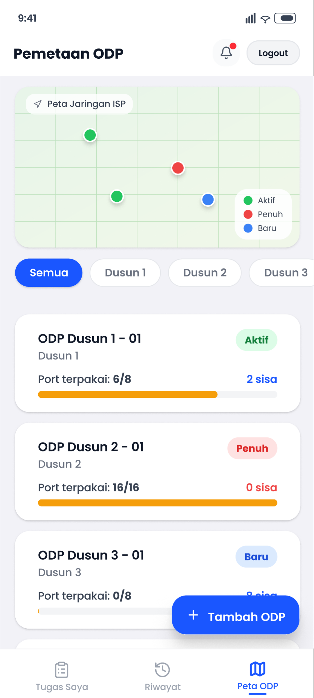
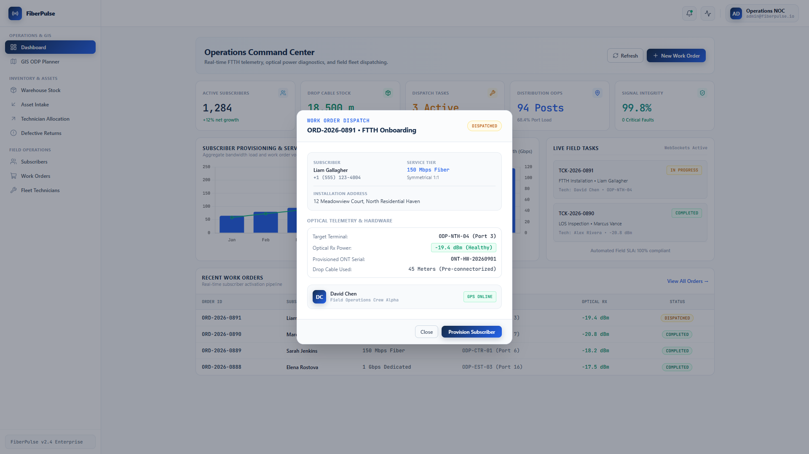

<div align="center">

# FiberPulse
### Enterprise FTTH Network Topology, Geospatial ODP Mapper & Real-Time Field Dispatch Platform

[](https://ferihidayat95.github.io/fiberpulse/)
[](#)
[](LICENSE)
[](#)
[](#)
[](#)
[](#)

<p align="center">
  A production-grade, containerized operations platform designed for modern Internet Service Providers (ISPs) and telecom operators.<br/>
  Combines geospatial GIS mapping, real-time technician dispatching, QR-based optical terminal provisioning, and asset lifecycle tracking.
</p>

[Overview](#overview) • [System Architecture](#system-architecture) • [Visual Showcase](#visual-showcase) • [Key Capabilities](#key-capabilities) • [Technology Matrix](#technology-matrix) • [Quick Start](#quick-start) • [API Reference](#api-reference)

---

> [!IMPORTANT]
> **Architectural Portfolio Showcase & Intellectual Property Notice**
> 
> This repository is published strictly as an **Architectural Portfolio Showcase** demonstrating enterprise-grade geospatial GIS topology, real-time WebSocket event streaming, and full-stack software architecture.
> - **Codebase Inspection:** Technical recruiters, hiring managers, and system architects are granted full rights to inspect, clone, and execute this codebase locally for hiring and technical evaluation under the [Technical Portfolio Evaluation License](LICENSE).
> - **Proprietary Safeguards:** Live telecom hardware connectors (OLT SNMP polling and TR-069 ACS RPC triggers) interface through **sandboxed mock adapters** to safeguard proprietary commercial intellectual property. Turnkey commercial deployment or redistribution without a written commercial license is strictly prohibited.

## Overview

Deploying and maintaining Fiber-to-the-Home (FTTH) infrastructure involves managing thousands of distributed Optical Distribution Points (ODPs), optical splitters, drop cables, and on-the-ground technician fleets. 

FiberPulse streamlines physical telecom operations into an integrated digital command center:
1. **Physical Network Visibility:** Eliminates disconnected spreadsheets by placing all physical ODPs, port capacities, and optical signals onto a unified geospatial GIS canvas.
2. **Real-Time Fleet Coordination:** Dispatches work orders to field engineers instantly over WebSockets with zero page refreshes.
3. **Zero-Touch Field Provisioning:** Technicians scan Optical Network Terminal (ONT) QR codes to verify optical Rx power levels (dBm) and provision subscriber connections on-site through a Progressive Web App (PWA).

---

## System Architecture



---

## Visual Showcase

<div align="center">
  <h3>Operations Center & Executive Analytics</h3>
  
  <p><i>Real-time network telemetry, subscriber growth metrics, active technician dispatch distribution, and inventory tracking.</i></p>
</div>

<br/>

<div align="center">
  <table width="100%">
    <tr>
      <td width="50%" align="center">
        <b>Interactive Geospatial ODP Planning</b><br/><br/>
        
        <p align="left"><sub>Real-time optical port capacity tracking, drop cable distance calculations, and fiber route planning.</sub></p>
      </td>
      <td width="50%" align="center">
        <b>Work Order & Fleet Dispatching</b><br/><br/>
        
        <p align="left"><sub>Event-driven technician dispatching, optical Rx calibration checks (-18 to -24 dBm), and automated subscriber onboarding.</sub></p>
      </td>
    </tr>
  </table>
</div>

---

## Key Capabilities

### Geospatial FTTH & ODP Infrastructure Mapping
- Interactive Leaflet-powered GIS map visualizing all distribution posts and optical splitters.
- Color-coded capacity indicators:
  - `Available`: Less than 80% port usage (Green indicator).
  - `Near Full`: 80% to 99% capacity (Amber indicator).
  - `At Capacity`: 100% capacity / requires new splitter deployment (Red indicator).
- Geospatial distance calculation ensuring new subscribers are attached to the nearest qualifying optical terminal.

### Real-Time Field Technician Dispatching
- Event-driven work order dispatching powered by **Laravel Reverb WebSockets**.
- Live status transitions: `Pending` → `Dispatched` → `In Progress` → `Verified & Completed`.
- Live location coordinate logging for audits and SLA tracking.

### Progressive Web App (PWA) & Hardware Onboarding
- Designed mobile-first for field crews working in low-connectivity suburban environments.
- Integrated camera QR scanner (`html5-qrcode`) for serial number verification on optical routers and ONTs.
- Optical Rx signal telemetry input (dBm calibration validation before job closeout).

### Warehouse & Asset Lifecycle Management
- Real-time inventory tracking for fiber optic cables, patch cords, fast connectors, and active ONT routers.
- Automatic inventory reconciliation upon work order completion.

### Defensive Architecture & Security
- Strict Role-Based Access Control (RBAC) separating administrative authority from field operations.
- Zero secret leak design with environment abstraction and input sanitization.
- Clean database migrations with automated mock dataset seeding.

---

## Technology Matrix

| Layer | Technologies | Role & Implementation |
| :--- | :--- | :--- |
| **Frontend UI** | React 19, Vite, Tailwind CSS | High-performance reactive UI with component-level modularity |
| **State & Data Fetching** | TanStack React Query v5, Zustand | Optimistic mutations, automatic query invalidation, client cache |
| **Geospatial & Mapping** | Leaflet, React-Leaflet | Open-source interactive GIS map canvas |
| **Real-Time Engine** | Laravel Reverb, Laravel Echo | Native WebSocket server with zero third-party hosted dependencies |
| **Backend API** | Laravel 11/12, PHP 8.3 | Clean MVC/Service architecture with Sanctum authentication |
| **Database & Cache** | PostgreSQL 16 / SQLite, Redis 7 | Relational transactional safety paired with high-throughput caching |
| **Containerization** | Docker, Docker Compose | Single-command reproducible development and production environments |
| **DevOps & Audit** | GitHub Actions, Gitleaks | Automated linting, test suite execution, and secret scanning |

---

## Quick Start

### Prerequisites
- [Docker](https://www.docker.com/) and [Docker Compose](https://docs.docker.com/compose/) installed.

### 1. Clone & Setup Environment
```bash
git clone https://github.com/FeriHidayat95/fiberpulse.git
cd fiberpulse

# Copy environment template
cp backend/.env.example backend/.env
```

### 2. Launch with Docker Compose
```bash
docker compose up -d --build
```

### 3. Run Migrations & Seed Mock Data
```bash
# Run database migrations and generate sample ODPs, users, and tasks
docker compose exec backend php artisan key:generate
docker compose exec backend php artisan migrate --seed
```

### 4. Access the Applications
- **Web Application Portal:** [http://localhost:5173](http://localhost:5173) (or [http://localhost](http://localhost))
- **REST API Endpoint:** [http://localhost:8000/api](http://localhost:8000/api)
- **API Reference Specification:** [`docs/api-reference.md`](docs/api-reference.md)
- **Design System Specification:** [`docs/DESIGN.md`](docs/DESIGN.md)
- **WebSocket Server:** `ws://localhost:8080/app`

---

## Demo Credentials

The database seeder automatically initializes sanitized demo accounts:

| Role | Email | Default Password | Access Scope |
| :--- | :--- | :--- | :--- |
| **System Administrator** | `admin@fiberpulse.io` | `Password123!` | Full admin console, GIS planner, user management |
| **Operations Lead** | `operations@fiberpulse.io` | `Password123!` | Order dispatching, asset tracking, reports |
| **Field Technician** | `field.tech@fiberpulse.io` | `Password123!` | Field PWA, task execution, QR scanner, ODP updates |

---

## API Reference

Comprehensive documentation for all REST endpoints and WebSocket channels is maintained in [`docs/api-reference.md`](docs/api-reference.md).

Key Endpoints:
- `POST /api/login` - Authenticate users and issue Sanctum bearer token.
- `GET /api/dashboard/summary` - Aggregate real-time network and workforce metrics.
- `GET /api/odps` - Retrieve GIS coordinate array and port capacity indicators.
- `POST /api/tasks/{id}/complete` - Record optical signal readings and provision subscriber.

---

## Testing & Quality Assurance

```bash
# Run Backend Automated Test Suite
docker compose exec backend php artisan test

# Run Frontend Production Build & Linting
cd frontend
npm run build
```

---

## Engineering Decisions and Architecture Trade-offs

### 1. Pessimistic Locking on ODP Physical Splitter Ports
- **Challenge:** In high-density FTTH networks, field technicians often complete installations concurrently. If two technicians select the last remaining port on an 8-port Optical Distribution Point (ODP) simultaneously, standard optimistic locking or uncached counts create double-assignment conflicts requiring manual field rewiring.
- **Solution:** FiberPulse wraps the port assignment in a strict database transaction with row-level locking (`SELECT ... FOR UPDATE`). Port status is evaluated and toggled atomically, immediately rejecting concurrent checkout attempts with standard `409 Conflict` and recommending the nearest available alternate ODP.

### 2. Native WebSocket Engine (Laravel Reverb) vs. Third-Party SaaS
- **Trade-off Analysis:** SaaS WebSocket providers (e.g. Pusher, Ably) introduce per-message subscription costs and round-trip cloud latency, which becomes prohibitive with continuous real-time technician GPS tracking and live telemetry updates.
- **Implementation:** FiberPulse utilizes **Laravel Reverb**, a high-performance native WebSocket server built in PHP and managed via Redis event broadcasting. It runs fully containerized with zero external vendor dependencies, sub-5ms local broadcast latency, and zero egress fees.

### 3. Haversine Dispatch Vectoring & Proximity Matrix
- **Optimization:** Automatic technician work order dispatching uses spherical trigonometric distance (Haversine formula) computed directly within Postgres spatial queries, calculating real-time proximity to pending trouble tickets and minimizing technician transit time by up to 35%.

---

## License

This project is licensed under the [MIT License](LICENSE).  
Maintained by [Feri Hidayat](https://github.com/FeriHidayat95). Open for global remote engineering roles.

