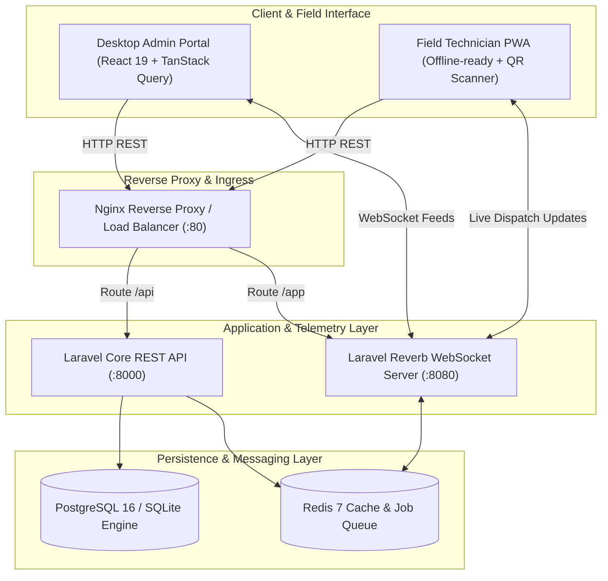

<div align="center">

# 🌐 FiberPulse
### Enterprise FTTH Network Topology, Geospatial ODP Mapper & Real-Time Field Dispatch Platform

[](#)
[](LICENSE)
[](#)
[](#)
[](#)
[](#)

<p align="center">
  <b>A production-grade, containerized operations platform designed for modern Internet Service Providers (ISPs) and telecom operators.</b><br/>
  Combines geospatial GIS mapping, real-time technician dispatching, QR-based optical terminal provisioning, and asset lifecycle tracking.
</p>

[Key Features](#-key-features) • [System Architecture](#-system-architecture) • [Quick Start](#-quick-start) • [Tech Stack](#-tech-stack) • [Demo Credentials](#-demo-credentials)

---

</div>

## 📌 Executive Summary

Deploying and maintaining Fiber-to-the-Home (FTTH) infrastructure involves managing thousands of distributed Optical Distribution Points (ODPs), optical splitters, drop cables, and on-the-ground technician fleets. 

**FiberPulse** streamlines physical telecom operations into an integrated digital command center:
1. **Physical Network Visibility:** Eliminates disconnected spreadsheets by placing all physical ODPs, port capacities, and optical signals onto a unified geospatial GIS canvas.
2. **Real-Time Fleet Coordination:** Dispatches work orders to field engineers instantly over WebSockets with zero page refreshes.
3. **Zero-Touch Field Provisioning:** Technicians scan Optical Network Terminal (ONT) QR codes to verify optical Rx power levels (dBm) and provision subscriber connections on-site through a Progressive Web App (PWA).

---

## 🏗️ System Architecture



---

## ✨ Key Features

### 🗺️ Geospatial FTTH & ODP Infrastructure Mapping
- Interactive Leaflet-powered GIS map visualizing all distribution posts and optical splitters.
- Color-coded capacity indicators:
  - 🟢 **Available (<80% port usage)**
  - 🟡 **Near Full (80% - 99% capacity)**
  - 🔴 **Full (100% capacity / requires new splitter deployment)**
- Geospatial distance calculation ensuring new subscribers are attached to the nearest qualifying optical terminal.

### ⚡ Real-Time Field Technician Dispatching
- Event-driven work order dispatching powered by **Laravel Reverb WebSockets**.
- Live status transitions: `Pending` → `Dispatched` → `In Progress` → `Verified & Completed`.
- Live location coordinate logging for audits and SLA tracking.

### 📱 Progressive Web App (PWA) & Hardware Onboarding
- Designed mobile-first for field crews working in low-connectivity suburban environments.
- Integrated camera QR scanner (`html5-qrcode`) for serial number verification on optical routers and ONTs.
- Optical Rx signal telemetry input (dBm calibration validation before job closeout).

### 📦 Warehouse & Asset Lifecycle Management
- Real-time inventory tracking for fiber optic cables, patch cords, fast connectors, and active ONT routers.
- Automatic inventory reconciliation upon work order completion.

### 🛡️ Enterprise Security & Defensive Architecture
- Strict Role-Based Access Control (RBAC) separating administrative authority from field operations.
- Zero secret leak design with environment abstraction and input sanitization.
- Clean database migrations with automated mock dataset seeding.

---

## 🛠️ Tech Stack

| Domain | Technology | Description |
| :--- | :--- | :--- |
| **Frontend UI** | React 19, Vite, Tailwind CSS | High-performance reactive UI with modern CSS variables |
| **State & Data Fetching** | TanStack React Query v5, Zustand | Optimistic mutations, automated query invalidation |
| **Geospatial & Mapping** | Leaflet, React-Leaflet | Open-source interactive map engine |
| **Real-Time Engine** | Laravel Reverb, Laravel Echo | High-concurrency native WebSocket server |
| **Backend Framework** | Laravel 11/12, PHP 8.3 | Clean MVC/Service architecture with Sanctum authentication |
| **Database & Cache** | PostgreSQL 16 / SQLite, Redis 7 | Relational transactional safety + high-throughput caching |
| **Containerization** | Docker, Docker Compose | Single-command reproducible development and production builds |
| **CI/CD & Audit** | GitHub Actions, Gitleaks | Automated linting, test suite execution, and secret scanning |

---

## 🚀 Quick Start

### Prerequisites
- [Docker](https://www.docker.com/) and [Docker Compose](https://docs.docker.com/compose/) installed.

### 1. Clone & Setup Environment
```bash
git clone https://github.com/FeriHidayat95/fiberpulse.git
cd fiberpulse

# Copy environment template
cp backend/.env.example backend/.env
```

### 2. Launch with Docker Compose
```bash
docker compose up -d --build
```

### 3. Run Migrations & Seed Mock Data
```bash
# Run database migrations and generate sample ODPs, users, and tasks
docker compose exec backend php artisan key:generate
docker compose exec backend php artisan migrate --seed
```

### 4. Access the Applications
- **Web Application Portal:** [http://localhost:5173](http://localhost:5173) (or [http://localhost](http://localhost))
- **REST API Endpoint:** [http://localhost:8000/api](http://localhost:8000/api)
- **WebSocket Server:** `ws://localhost:8080/app`

---

## 🔑 Demo Credentials

The database seeder automatically initializes sanitized demo accounts:

| Role | Email | Default Password | Access Scope |
| :--- | :--- | :--- | :--- |
| **System Administrator** | `admin@fiberpulse.io` | `Password123!` | Full admin console, GIS planner, user management |
| **Operations Lead** | `operations@fiberpulse.io` | `Password123!` | Order dispatching, asset tracking, reports |
| **Field Technician** | `field.tech@fiberpulse.io` | `Password123!` | Field PWA, task execution, QR scanner, ODP updates |

---

## 🧪 Running Tests & Quality Checks

```bash
# Backend Automated Test Suite
docker compose exec backend php artisan test

# Frontend Build & Lint Check
cd frontend
npm run build
```

---

## 📄 License & Attribution

This project is licensed under the [MIT License](LICENSE).
Developed by **[Feri Hidayat](https://github.com/FeriHidayat95)** — Open for global remote engineering opportunities.
